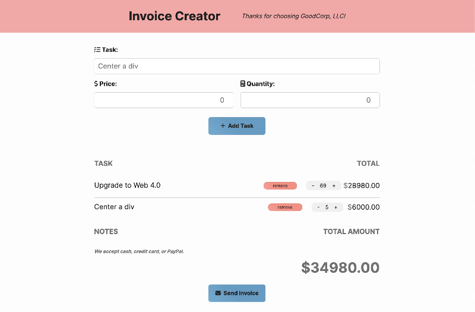
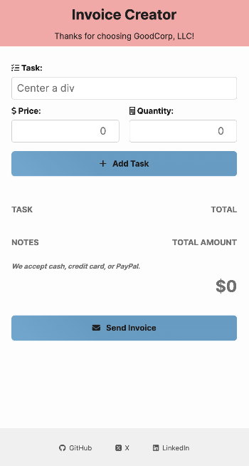
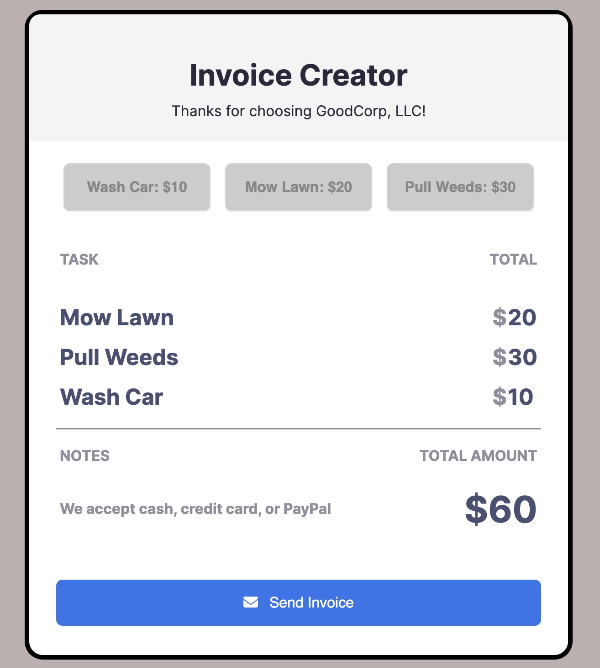
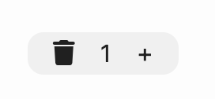
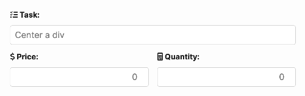

# Invoice Creator: Scrimba Bootcamp Solo Project

## Table of Contents
- [Overview](#overview)
    - [Current Version](#current-version)
- [Requirements](#requirements)
    - [Initial Requirements](#initial-requirements)
    - [Stretch Goals](#stretch-goals)
- [Design Mockups](#design-mockups)
- [Initial Challenges](#initial-challenges)
- [Refactoring Journey](#refactoring-journey)
    - [My Blueprint for JavaScript Refactoring](#my-blueprint-for-javascript-refactoring)
- [Key Enhancements](#key-enhancements)
- [Local Development](#local-development)
- [About Scrimba](#about-scrimba)


## Overview

This project is a solo endeavor from the Scrimba bootcamp, conceived and built from the ground up. Its core purpose is to facilitate users in generating invoices efficiently. The application leans heavily on vanilla JavaScript, HTML, and CSS, ensuring a seamless and intuitive web experience.

### Current Version

Deployed on: 06-09-2023

Last Updated: 10-26-2023

[](https://app.netlify.com/sites/invoice-creator-tak40/deploys)

Here's a glimpse of the current state of the project:

**Desktop View**:



**Mobile View**:



## Requirements

### Initial Requirements
- Array to hold requested tasks
- Buttons to add a task to array
- Display data from array; should update when the array changes
- Charge only once for each task
- Update total amount each time a task gets added
- Button to "send invoice" (reset)

### Stretch Goals
- Enter tasks
- Text field for task
- Select menu with cost options
- Add new task and cost to the array and update task list
- Remove tasks

## Design Mockups

The design blueprints for this project are hosted on Figma. Interested readers can peruse them [here](https://www.figma.com/file/ejHmm5h6VhSW7dQgRgOmlk/Invoice-Creator?node-id=0%3A1&t=nxSAEKc5XGTtzEmR-1).

## Initial Challenges

During the early stages of the project, I aimed to get a working version up and running. I frequently switched between Scrimba's materials and other online guides. This back-and-forth, along with getting to grips with JavaScript, often left me puzzled and stalled.

- Initial [Scrim](https://scrimba.com/scrim/coa53415a933225d86da9b633) for the project 



To give you an idea, here's a glimpse of my initial "spaghetti code" (haha):

```javascript
// This function displays a selected task in the task list.
function displaySelectedTask(taskName, taskPrice) {
    const namesSection = document.getElementById('task-names');
    const pricesSection = document.getElementById('task-prices');
    const newTaskNameParagraph = document.createElement('p');
    const newTaskNameSpan = document.createElement('span');

    newTaskNameSpan.classList.add('task-name-style');
    newTaskNameSpan.textContent = taskName;

    newTaskNameParagraph.appendChild(newTaskNameSpan);
    namesSection.appendChild(newTaskNameParagraph);

    const newTaskPriceParagraph = document.createElement('p');
    const dollarSignSpan = document.createElement('span');
    dollarSignSpan.classList.add('dollar-sign-style');
    dollarSignSpan.textContent = "$";
    newTaskPriceParagraph.appendChild(dollarSignSpan);

    const newTaskPriceSpan = document.createElement('span');
    newTaskPriceSpan.classList.add('task-price-style'); 
    newTaskPriceSpan.textContent = taskPrice;
    newTaskPriceParagraph.appendChild(newTaskPriceSpan);
    pricesSection.appendChild(newTaskPriceParagraph); 
}
```


## Refactoring Journey

### The refactoring was influenced by three primary reasons:
1. The existing code, while functional, was far from optimal in terms of readability and structure.
2. The stretch goals, initially perceived as challenging, mandated a more organized approach.
3. "How can I elevate this bootcamp project?"

### The main goals during this phase were:
- Streamlining the JavaScript logic.
- Ensuring mobile responsiveness.
- Achieving the outlined stretch goals.
- Formulating and realizing personal stretch goals.

### My Blueprint for JavaScript Refactoring

After thoughtful consideration, I established a blueprint for my refactoring process (as of now):

1. Get the DOM: Identify the main elements to manipulate.
2. Event Handlers: Pinpoint interactive elements like buttons or links.
3. Core Functions: Define essential functions based on the DOM and interactions.
4. Separate Concerns: Break down and categorize functions for clarity and maintainability.

By following this structured approach, I was able to achieve a more efficient and organized application.

## Key Enhancements

- **E-commerce Inspired Design**: Drawing inspiration from prominent e-commerce platforms, including the likes of DoorDash and others, the user interface was redesigned for a more intuitive and familiar feel. Below is an image showcasing the e-commerce inspired design:

 

- **Dynamic Task Entry**: The task entry section underwent a major revamp. Now, not only can users input tasks, but they also have the capability to specify the price and quantity. This dynamic entry format simplifies the invoice creation process, as depicted in the image above.

 

- **Modal Implementation**: Integrated modals using the `<dialog>` tag post a workshop at Scrimba, adding a layer of sophistication. 

    Here's a glimpse into the modal structure:

    ```html
        <!-- Invoice Modal -->
    <dialog id="invoice-modal" class="invoice-modal">
        <form method="dialog">
            <fieldset>
                <legend>Send Invoice</legend>
                <label for="email">Email:</label>
                <input type="email" id="email" class="modal-email-input" required>
                <label for="message">Message:</label>
                <textarea id="message" rows="4" required></textarea>
                <menu>
                    <button id="submit-modal-btn" class="modal-btn modal-send-invoice-btn" type="submit">Send Invoice</button>
                    <button id="cancel-modal-btn" class="modal-btn modal-cancel-btn" type="reset">Cancel</button>
                </menu>
            </fieldset>
        </form>
    </dialog>

    <!-- Confirmation Modal -->
    <dialog id="confirmation-modal" class="confirmation-modal">
        <p>Invoice Sent Successfully!</p>
        <button id="close-confirm-modal-btn" class="modal-btn modal-close-btn">OK</button>
    </dialog>    
    ```

- **Beyond Stretch Goals**: The project was constantly evolved to not just meet but surpass the stretch goals, aiming for a production-grade web application standard.


## Local Development

Quick start:

```
$ npm install
$ npm start
````

Head over to https://vitejs.dev/ to learn more about using vite

## About Scrimba

At Scrimba our goal is to create the best possible coding school at the cost of a gym membership! 💜
If we succeed with this, it will give anyone who wants to become a software developer a realistic shot at succeeding, regardless of where they live and the size of their wallets 🎉
The Frontend Developer Career Path aims to teach you everything you need to become a Junior Developer, or you could take a deep-dive with one of our advanced courses 🚀

- [Our courses](https://scrimba.com/allcourses)
- [The Frontend Career Path](https://scrimba.com/learn/frontend)
- [Become a Scrimba Pro member](https://scrimba.com/pricing)

Happy Coding!
